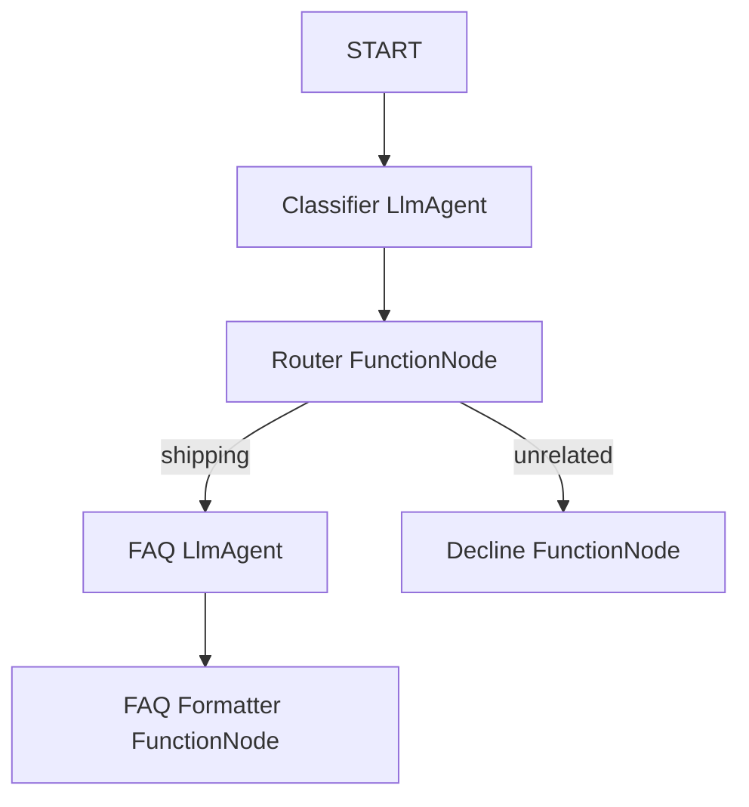

# Customer Support Agent - Graph Workflow Design Spec

## Overview
This spec defines a customer support graph workflow agent built with ADK 2.0. The agent acts as a customer support representative for a shipping company, routing shipping-related questions to an FAQ assistant and declining unrelated queries.

## Architecture

The workflow graph is structured as follows:



### Components

1. **START**: Entry point receiving the user input.
2. **ClassifierAgent** (`LlmAgent`):
   - **Purpose**: Semantically classify the query as either shipping-related (rates, tracking, delivery, returns) or unrelated.
   - **Output Schema**:
     ```python
     class Classification(BaseModel):
         is_shipping_related: bool
         query: str
     ```
3. **RouterNode** (`FunctionNode`):
   - **Purpose**: Evaluates `is_shipping_related` and routes the original query to the appropriate node by returning an `Event`.
   - **Routes**: `"shipping"`, `"unrelated"`
4. **FAQAgent** (`LlmAgent`):
   - **Purpose**: Answer shipping FAQ questions based on hardcoded knowledge in its instruction.
   - **Instruction Content**: Includes mock answers for shipping rates, tracking, delivery times, and returns.
   - **Output Schema**:
     ```python
     class FAQResponse(BaseModel):
         answer: str
     ```
5. **FAQFormatter** (`FunctionNode`):
   - **Purpose**: Extracts `answer` and yields a user-facing `Content` event and the final output event.
6. **DeclineNode** (`FunctionNode`):
   - **Purpose**: Declines to answer politely. Yields a user-facing `Content` event and the final output event.

## Data Schemas

```python
from pydantic import BaseModel

class WorkflowInput(BaseModel):
    query: str

class Classification(BaseModel):
    is_shipping_related: bool
    query: str

class FAQResponse(BaseModel):
    answer: str
```

## Mock FAQs to Include in Instruction
- **Rates**: Standard shipping is $5.99 (3-5 business days), Express is $14.99 (1-2 business days), and free for orders over $50.
- **Tracking**: Customers can track orders using their 10-digit tracking number on our tracking portal.
- **Delivery**: Standard shipping takes 3-5 business days; Express takes 1-2 business days.
- **Returns**: Returns are accepted within 30 days of delivery. Pre-paid return labels are provided for a $3.00 return shipping fee.

## Verification Plan
1. **Unit/Smoke Testing**: Use `agents-cli run "shipping query"` and `agents-cli run "unrelated query"` to verify correct routing and response behavior.
2. **Interactive Playground**: Use `agents-cli playground` to run manual chat conversations.
3. **Evaluation**: Synthesize evaluation datasets using `agents-cli eval dataset synthesize` and run evaluation using `agents-cli eval run`.
