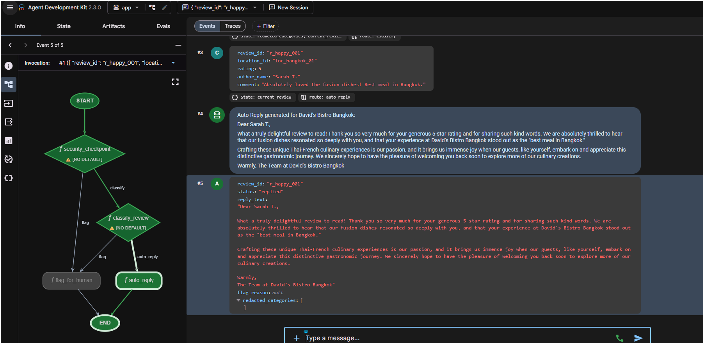

# Google Business Profile (GBP) Review Triage Agent

This is a local prototype of an ambient GBP review triage agent. The agent uses the **Agent Development Kit (ADK) 2.0** graph-based `Workflow` API to automatically reply to positive reviews or flag problematic reviews for human intervention.

## 📂 Project Structure

```
gbp-review-triage/
├── app/                      # Core agent code
│   ├── README.md             # ← Agent input/output contract + payload examples
│   ├── agent.py              # Main graph Workflow logic (nodes, edges, HITL)
│   ├── fast_api_app.py       # FastAPI application wrapper with local SQLite sessions
│   ├── models.py             # Pydantic schemas (ReviewInput, LocationProfile, TriageResult)
│   └── app_utils/            # App telemetry and utilities
├── tests/                    # Evaluation configurations and test datasets
│   └── eval/
│       ├── eval_config.yaml  # Metric definitions (response quality, turn count)
│       └── datasets/
│           ├── README.md     # ← Eval dataset format and grading guide
│           └── triage-dataset.json  # Mock review test cases
├── reviews.json              # Sample GBP review mock dataset
├── .env                      # Local authentication configurations (GCP vs AI Studio)
├── pyproject.toml            # Project dependencies and linting tool configuration
└── README.md                 # This file
```

---

## ⚙️ Prerequisites & Installation

1. **Python & uv**: Ensure you have Python >= 3.11 and the `uv` package manager installed.
2. **Install agents-cli**:
   ```bash
   uv tool install google-agents-cli
   ```
3. **Install Dependencies**:
   Run from the project root directory:
   ```bash
   agents-cli install
   ```

---

## 🔑 Authentication Setup

Before running the agent, set up authentication in the `.env` file at the root of the project:

### Option 1: Google Cloud (Vertex AI) - *Recommended*
1. Authenticate your local shell using Google Cloud SDK:
   ```bash
   gcloud auth application-default login
   ```
2. Configure `.env` with your project ID:
   ```env
   GOOGLE_CLOUD_PROJECT="your-google-cloud-project-id"
   GOOGLE_CLOUD_LOCATION="us-east1"
   GOOGLE_GENAI_USE_VERTEXAI="True"
   ```

### Option 2: Google AI Studio (Gemini Developer API)
1. Generate an API key in [Google AI Studio](https://aistudio.google.com/).
2. Edit your `.env` file to supply the key and disable Vertex AI mode:
   ```env
   GEMINI_API_KEY="your-ai-studio-api-key"
   GOOGLE_GENAI_USE_VERTEXAI="False"
   ```

---

## 🔄 Running and Resuming Sessions (Standalone Mode)

Local session state is persisted on disk inside a local SQLite database file (`sessions.db`). This allows local sessions to survive server restarts, idle timeouts, and separate execution commands.

### Running with a One-Off Prompt
Execute a quick query via the CLI:
```bash
agents-cli run "Test prompt"
```

### Starting and Persisting Conversations
Use `--session-id` to resume and maintain conversational context.

1. **Start a new session**:
   ```bash
   uv run agents-cli run --session-id "session_123" "{\"review_id\": \"r001\", \"location_id\": \"loc_bangkok_01\", \"rating\": 5, \"author_name\": \"Sarah T.\", \"comment\": \"Great meal!\"}"
   ```
2. **Resume/Query the same session**:
   ```bash
   uv run agents-cli run --session-id "session_123" "Do you remember my rating?"
   ```

### Web-Based Interactive Playground
Launch a local development playground to test the agent visually via a web browser:
```bash
agents-cli playground
```
This starts the local FastAPI server and launches the interactive web interface. Any conversations started here will persist inside `sessions.db`.

---

## 📥 Agent Input Format

The agent accepts a **plain JSON string** as its message — no envelope, just the object:

```json
{
  "review_id": "r_happy_001",
  "location_id": "loc_bangkok_01",
  "rating": 5,
  "author_name": "Sarah T.",
  "comment": "Absolutely loved the fusion dishes! Best meal in Bangkok."
}
```

| Field | Type | Notes |
| --- | --- | --- |
| `review_id` | string | Used as the HITL interrupt ID |
| `location_id` | string | `loc_bangkok_01` or `loc_bangkok_02` for dev/test |
| `rating` | int 1–5 | ≥ 4 → auto-reply · ≤ 3 → HITL flag |
| `author_name` | string | Reviewer display name |
| `comment` | string | Scrubbed for PII, scanned for injection before any LLM call |

For the full contract — all four decision paths with expected outputs, PII redaction examples, and prompt-injection examples — see **[app/README.md](app/README.md)**.

---

## 🎮 Test in the ADK Playground

Before deploying or making the agent ambient, verify the full workflow interactively in the ADK Playground.

### Quick Start (Makefile)

> **Windows Note:** `make` is not installed by default on Windows. Use the **PowerShell commands** shown below. Also, `agents-cli playground` has a known Windows bug where the `*` in `--allow_origins *` gets glob-expanded — use the `adk web` workaround shown in Step 1 instead.

| Makefile Target | What it does |
|---|---|
| `make install` | Install all dependencies |
| `make playground` | Launch ADK playground (Linux/Mac) |
| `make test-5star` | Send 5-star review payload |
| `make test-3star` | Send 3-star review payload |
| `make test` | Run security unit tests |

### Step 1 — Launch the Playground

**On Windows**, bypass `agents-cli playground` and run `adk web` directly. This avoids the `--allow_origins *` glob-expansion bug:

```powershell
# Terminal 1 — keep this running
uv run adk web app --host 127.0.0.1 --port 8000
```

**On Linux/Mac**, the standard command works:

```bash
# Terminal 1 — keep this running
agents-cli playground --port 8000
```

The server is ready when you see `ADK Web Server started` and `Uvicorn running on http://127.0.0.1:8000`.

### Step 2 — Send a 5-Star Review (Auto-Reply Path)

Open a **second terminal** and start the API server (needed because `agents-cli run` also has a Windows glob issue when auto-starting its own server):

```powershell
# Terminal 2 — keep this running alongside Terminal 1
uv run adk api_server app --host 127.0.0.1 --port 8001
```

Then in a **third terminal**, submit the positive review:

```powershell
# Terminal 3
uv run agents-cli run --url "http://127.0.0.1:8001" --mode adk --app-name app "{\"review_id\": \"r_test_5\", \"location_id\": \"loc_bangkok_01\", \"rating\": 5, \"author_name\": \"Sarah T.\", \"comment\": \"Absolutely loved the fusion dishes! Best meal in Bangkok.\"}"
```

**Expected Behavior:**
1. `security_checkpoint` → passes (no PII, no injection)
2. `classify_review` → routes to `auto_reply` (rating 5, no flagged keywords)
3. `auto_reply` → Gemini generates a warm, on-brand thank-you reply for *David's Bistro Bangkok*
4. ✅ Session completes — no human intervention required

**Live result** (ADK Playground, 2026-06-23):



The workflow graph shows the execution trace through `security_checkpoint` → `classify_review` → `auto_reply` → `END`. Event #5 returns `status: "replied"` with the full generated reply text and `redacted_categories: []`.

### Step 3 — Send a 3-Star Review (HITL Flag Path)

From Terminal 3, submit the mediocre review:

```powershell
uv run agents-cli run --url "http://127.0.0.1:8001" --mode adk --app-name app "{\"review_id\": \"r_test_3\", \"location_id\": \"loc_bangkok_02\", \"rating\": 3, \"author_name\": \"Tom R.\", \"comment\": \"Food was okay but the service was extremely slow and the oysters tasted off.\"}"
```

**Expected Behavior:**
1. `security_checkpoint` → passes (clean input)
2. `classify_review` → routes to `flag_for_human` (rating ≤ 3)
3. `flag_for_human` → **pauses execution**, yields a `RequestInput` with the review details
4. ⏸️ Session pauses — the CLI prints the session ID for resuming

### Step 4 — Verify in the Playground UI

1. Open **http://127.0.0.1:8000/dev-ui/** in your browser
2. Select the **`app`** agent from the dropdown
3. You should see **two sessions** — one completed (5-star) and one paused (3-star)
4. Click on the **paused 3-star session** to see the HITL input form
5. You have three options:
   - Type **`APPROVE`** → the agent generates a professional apology response via Gemini
   - Type **`IGNORE`** → the review is dismissed with no reply
   - Type a **custom response** → your text is used as the reply verbatim
6. Submit your choice and verify the workflow completes with the appropriate `TriageResult`

### Troubleshooting

| Issue | Fix |
|---|---|
| `agents-cli` not found | Run `uv tool install google-agents-cli` |
| `agents-cli playground` fails on Windows | Use `uv run adk web app --host 127.0.0.1 --port 8000` directly |
| `agents-cli run` fails on Windows (no `--url`) | Start api_server manually: `uv run adk api_server app --port 8001`, then pass `--url http://127.0.0.1:8001 --mode adk` |
| Port already in use | Change `--port 8000` / `--port 8001` to free ports |
| Auth errors | Ensure `.env` is configured and run `gcloud auth application-default login` |
| No sessions visible in UI | Use `http://127.0.0.1:8000/dev-ui/` not `localhost` (Windows IPv6 issue) |

---

## 📊 Evaluation & Testing

Systematic validation is performed using evaluation datasets and metrics (LLM-as-a-judge) rather than static pytest assertions.

### How Offline HITL Evaluation Works
The evaluation runner executes tests in a non-interactive, single-turn mode. If a review is flagged, the agent would normally pause and yield a `RequestInput` to wait for a human. To prevent the evaluation runner from crashing/hanging during this offline phase, the agent automatically detects the evaluation run environment and auto-approves (`human_response = "APPROVE"`) the flagged review.

### Running the Evaluation Suite
1. **Generate traces**:
   ```bash
   uv run agents-cli eval generate --dataset tests/eval/datasets/triage-dataset.json --output triage_traces/
   ```
2. **Grade the generated traces**:
   ```bash
   uv run agents-cli eval grade --traces triage_traces/
   ```


---

## 🔒 Security Validation: PII Redaction & Prompt-Injection Defense

To protect sensitive data and prevent unauthorized instruction overrides, we have integrated a local security validation layer at the entrance of the agent workflow.

For detailed design, implementation, and test execution details, see the [Security Checkpoint Walkthrough](../docs/superpowers/walkthroughs/2026-06-23-gbp-security-checkpoint.md).

### Key Protections
1. **PII Redaction**: US Social Security Numbers (`[REDACTED_SSN]`) and Credit Card numbers (`[REDACTED_CC]`) are scrubbed using regular expressions and Luhn algorithm validation.
2. **Prompt-Injection Defense**: Scans input comments for command-override patterns and routes them directly to the human flag queue (`flag_for_human`), bypassing all LLM API generations.

### Running Security Validation Tests
Execute the unit tests verifying safety heuristics and security checkpoint routing:
```bash
uv run pytest tests/unit/test_security.py
```

---

## 🛠️ Code Quality
To check code format, types, and styles, run:
```bash
agents-cli lint
```
To auto-fix style and import formatting:
```bash
agents-cli lint --fix
```
